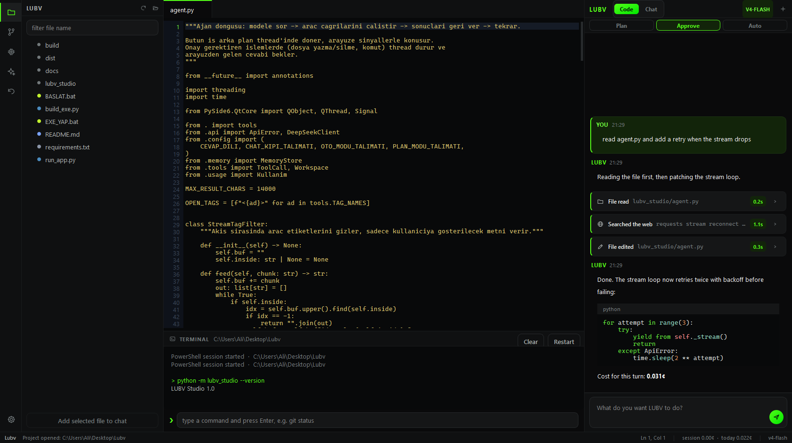

# LUBV Studio — Documentation

> This is the `docs` branch. Long-form manual, kept separate from the source so
> it can grow without adding noise to code diffs.
>
> Application: [`main`](../../tree/main) · Developer guide: [`develop`](../../tree/develop)

---

## Contents

| Page | What it covers |
|---|---|
| [Getting started](getting-started.md) | Install, API key, first project, first task |
| [Writing the brain](writing-the-brain.md) | How the system prompt works and how to write a good one |
| [Tool reference](tool-reference.md) | Every tool the agent can call, with exact syntax |
| [Cost and models](cost-and-models.md) | Pricing, token accounting, which model to pick |
| [Troubleshooting](troubleshooting.md) | Things that go wrong and what to do about them |

---

## In one paragraph

LUBV Studio is a desktop coding agent that runs on your DeepSeek API key. It
looks like a small IDE: file tree on the left, tabbed editor and a live
PowerShell in the middle, the agent on the right. What makes it different is
that the agent's system prompt is a text box you own. There is no vendor
personality layered above your instructions and no refusal logic added by the
application. You define the behaviour, and the agent carries it out against
your actual project: reading files, editing them surgically, running commands,
searching the web, and remembering what matters between sessions.

## The short version of everything

**Two working modes.** *Code* gives the agent tools and your project context.
*Chat* takes them away and leaves plain conversation.

**Three autonomy levels inside Code.** *Plan* only reads and produces a plan.
*Approve* shows you a diff before every write and waits. *Auto* does the whole
job and fixes its own errors.

**Ten tools.** Read, edit, write, list, search, delete, run a command, search
the web, fetch a page, write to memory. Every file path is confined to the
project root.

**Everything is reversible.** Each file the agent touches is snapshotted first.
The Undo panel restores any of them with one click.

**You always know the bill.** Token counts and USD cost are recorded per
request and totalled per session, per day and all time.

**Two interface languages.** Turkish and English. The agent replies in whichever
one is selected, regardless of what language you type in.

## Design principles

**The prompt belongs to the user.** The only thing the application appends to
your brain is the tool protocol, because without it the agent has no way to
express an action. Everything else in the system prompt is yours.

**Show the work.** Every tool call becomes a visible card with its target, its
duration and its full output. Every git command runs in the terminal you can
read. Nothing important happens behind a spinner.

**Destructive actions are gated, not prevented.** The default is to ask, with a
diff. You can turn that off per action type, or switch to Auto and let it run.
Either way the checkpoint is written before the change, so the exit is always
open.

**Confinement over trust.** Path safety is enforced by resolving and checking
every path against the project root, not by asking the model nicely in the
prompt.

## License

MIT. See [LICENSE](LICENSE).
