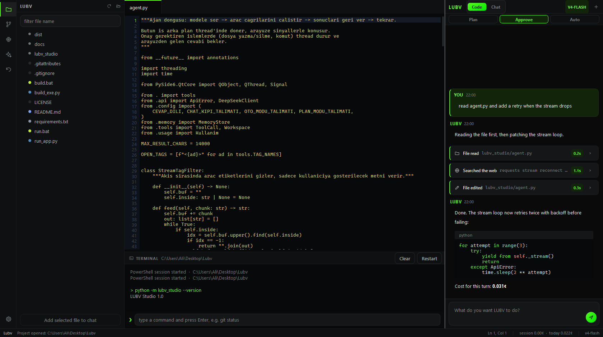

<div align="center">

# LUBV Studio

**A desktop vibe coding agent powered by DeepSeek. The brain is yours.**

No vendor system prompt. No hidden instruction layer. No opinionated guard rails
bolted on top of your agent. You write the brain, LUBV executes it against your
real project: reading files, writing code, running commands, searching the web.

[](LICENSE)




</div>

---

## What this is

Most AI coding tools ship with a personality you cannot see and cannot remove.
Their system prompt sits above yours, quietly rewriting how the model behaves.

LUBV Studio does the opposite. The **Brain** panel is the entire system prompt,
it is yours, it is editable, and it persists. The only thing the app appends is
the tool protocol the agent needs to actually touch your machine. If you want an
agent that argues, an agent that ships without commentary, or an agent with a
personality you invented at 3am, you paste it in and it is live on the next
message.

Everything else is built so that agent can do real work: a full editor, a real
shell, source control, web access, persistent memory, and a per request cost
meter so you always know what you are spending.

> The model provider's own policies still apply to API responses. What LUBV
> removes is *our* layer, not DeepSeek's.

## Highlights

| | |
|---|---|
| **Your prompt, unfiltered** | The Brain panel is the whole system prompt. Nothing hidden above it. |
| **Runs until the job is done** | No step limit by default. The loop only ends when the agent declares the task finished or you press Stop. |
| **Keep typing while it works** | Send another message mid-task. It is folded into the running job, or queued and started automatically. |
| **Saved sessions** | Every chat is written to disk with its full transcript. Browse, search, reopen, rename and delete them. |
| **Live balance** | Remaining API credit sits in the top bar and refreshes on its own, and again the moment a request finishes. |
| **Prompt rules** | Teach LUBV the rules you want your requests judged against. It nudges you when a request is missing something. |
| **VS Code style workspace** | File tree with expand arrows, tabbed editor with syntax highlighting, integrated shell, chat. |
| **Three autonomy levels** | Plan (read only), Approve (diff before every write), Auto (hands off). |
| **Two working modes** | Code for agentic work, Chat for plain conversation with tools disabled. |
| **Web access** | Searches the web and reads pages, so it works with current docs and versions. |
| **Every change revertible** | Each file LUBV touches is checkpointed. One click restores the previous version. |
| **Live cost meter** | Token and USD accounting per request, per session, per day, all time. |
| **Persistent memory** | Notes that survive across chats, scoped per project or globally. |
| **Sandboxed** | Every path resolves inside the project root. Escapes are rejected, not warned about. |
| **Bilingual** | Turkish and English interface. The agent answers in whichever you pick. |
| **Cross platform** | Windows and macOS, with the shell, fonts and packaging adapted per platform. |

## Install

Runs on **Windows and macOS** (and Linux, less tested).

### Prebuilt application

Download the build for your platform from the [Releases](../../releases) page.
No Python, no dependencies.

- Windows: `LUBV Studio.exe`, a single file, just run it.
- macOS: `LUBV Studio.app`, drag it into Applications.

### From source

```bash
git clone https://github.com/alierenlibusiness/LubV-Studio.git
cd LubV-Studio
pip install -r requirements.txt
python -m lubv_studio
```

Or use the launcher for your platform, which installs the dependencies on
first run and then starts the app:

- Windows: double click `run.bat`
- macOS and Linux: `./run.sh`

### Build your own executable

```bash
python build_exe.py     # or build.bat on Windows, ./build.sh elsewhere
```

Output lands in `dist/`: a single `.exe` on Windows (~61 MB), a `.app` bundle
on macOS. Icons for both platforms are generated during the build.

## First run

1. **Pick a project folder.** The app asks on startup. LUBV is locked to this
   folder and cannot read or write outside it.
2. **Add your DeepSeek API key.** Settings panel (gear icon). Get one from
   [platform.deepseek.com](https://platform.deepseek.com). *Test connection*
   verifies the key and prints your remaining balance.
3. **Write the brain.** Open the Brain panel and paste your instructions. Save.
   That is now the system prompt for every request.
4. **Talk to it.** Type what you want in the chat on the right.

## The workspace

```
  LUBV Studio · project path        mode · session cost · balance
┌────┬──────────────┬──────────────────────────┬───────────────┐
│ 🗂 │              │   tabbed code editor     │  LUBV chat    │
│ 💬 │  file tree   │   line numbers, syntax   │  Code / Chat  │
│ ⑂  │  expand      │   Ctrl+S to save         │  Plan/Approve │
│ 🧠 │  arrows      ├──────────────────────────┤  /Auto        │
│ ✦  │              │   integrated terminal    │  messages +   │
│ ↩  │              │   exit code, duration    │  tool cards   │
│ ⚙  │              │   live, stateful         │  queue strip  │
└────┴──────────────┴──────────────────────────┴───────────────┘
  project · status · cursor · session cost · today cost · model
```

The top bar always shows the project path, the current mode, what this session
has cost and your **remaining API balance**, which refreshes on a timer and
again the moment a request finishes. Click it to refresh immediately.

The left rail switches the side panel: **Files**, **Sessions**, **Source
control**, **Memory**, **Brain**, **Undo**, **Settings**. Click the active icon
again to collapse the panel.

In the file tree, folders carry a VS Code style arrow: pointing right when
collapsed, down when open. A single click toggles a folder, a double click
opens a file.

## Sessions

Every conversation is a session, written to disk as it happens. The **Sessions**
panel lists them newest first with their project, message count and time, and
lets you search, open, rename and delete them, or clear the lot.

Reopening a session restores both halves of it: the message history the model
sees, and the visual transcript, including the tool cards with their output. The
session you are in is marked in the list, and starting a new chat saves the old
one first, so nothing is lost by accident.

## While it is working

You do not have to wait for a turn to end before typing again.

- If the agent is mid-task, your new message is **handed to the running job** and
  taken into account on its next step.
- If the job happens to finish in that instant, the message is **queued** and a
  fresh run starts automatically. The queue strip above the input shows what is
  waiting.
- **Stop** cancels the current turn and drops anything queued behind it.

The agent keeps going until it declares the task finished. If it stops with a
half-finished job, the loop prompts it to continue instead of handing control
back to you, and a dropped connection or a transient API error is retried rather
than ending the run. There is no step limit by default; set one in Settings if
you want a hard ceiling.

## Prompt rules

Settings has a **Prompt rules** block: the rules you want your own requests
judged against, editable and bilingual, with a sensible default set.

LUBV is given these rules along with the brain. When a request is clear it says
nothing and gets to work. When something is missing it makes the most reasonable
assumption, starts anyway, and adds a single line telling you what would have
made it faster. When a request is genuinely too vague to act on, it names the
missing rule and writes a corrected version of your request as an example. Turn
it off with one checkbox.

## Modes

**Code vs Chat.** Code gives the agent its tools and your project context.
Chat strips all of it: no file access, no commands, no project tree in the
prompt, just conversation.

**Within Code, three autonomy levels:**

- **Plan:** reads, searches and researches, then hands you a numbered
  implementation plan. Cannot modify anything. Use it before large refactors.
- **Approve** *(default)*: every write, delete and command stops for your
  confirmation, with a line by line diff of what is about to change.
- **Auto:** full autonomy. Writes, runs, reads the error, fixes it, runs again.
  Every change is still checkpointed and revertible.

## What the agent can do

| Tool | Behaviour |
|---|---|
| Read file | Returns the file with line numbers |
| Edit file | Surgical replacement of one exact block, cheaper and more precise than rewriting |
| Write file | Creates a file or replaces it wholesale |
| List folder | Directory contents |
| Search project | Full text search across the workspace |
| Delete file | Removes a file, after approval |
| Run command | Executes in the project folder, in the same shell the terminal panel uses: PowerShell on Windows, zsh on macOS |
| Web search | Live search for current docs, error messages, library versions |
| Fetch page | Opens a URL and extracts the readable text |
| Write memory | Leaves a durable note for future sessions |
| Task done | Declares the job finished. Until it appears, the loop keeps the agent working |

Tool cards report what actually happened rather than a stopwatch reading, so a
read shows the number of lines it took in and a command shows its exit code.

Every path is resolved against the project root. `..` and absolute paths outside
the workspace are rejected before the operation runs.

## Cost tracking

Usage comes back with every response and is priced against DeepSeek's published
rates (USD per 1M tokens):

| Model | Input (cache hit) | Input (cache miss) | Output |
|---|---|---|---|
| `deepseek-v4-flash` | $0.0028 | $0.14 | $0.28 |
| `deepseek-v4-pro` | $0.003625 | $0.435 | $0.87 |

The status bar shows session and daily spend at all times, and the top bar keeps
your remaining balance in view and refreshes it by itself. Settings breaks the
spend down by session, today, all time and the last few days. A typical request
costs between **0.02¢ and 0.5¢**.

Because there is no step limit by default, a large task can run for many steps.
The balance in the top bar is there so this never surprises you, and Stop always
ends the run immediately.

## Source control

The source control panel wraps the git workflow without leaving the app:
changed files, commit, push, pull, log and `git init`.

**Publishing to GitHub takes one click.** If the [GitHub CLI](https://cli.github.com)
is installed and signed in, the panel shows your account and *Create repo on
GitHub* does the whole thing: initialises the repository if needed, makes the
first commit, creates the remote repository (public or private, your choice)
and pushes. If the CLI is missing, it opens the new-repository page and you
paste the address back into the box.

For a repository that already exists, *Connect and push* accepts any of these
forms and normalises them:

```
user/repo
github.com/user/repo
https://github.com/user/repo
git@github.com:user/repo.git
```

If git has never been configured on the machine, the panel asks for a name and
email once and stores them, instead of failing with git's *"Author identity
unknown"*.

Every command runs in the integrated terminal, so you see exactly what ran and
what git said back. You can also just tell the agent: *"commit this and push
it."* Commands the agent runs are echoed into the same terminal.

## Keyboard

| Key | Action |
|---|---|
| `Enter` | Send message |
| `Shift+Enter` | New line |
| `Ctrl+S` | Save current file |
| `Ctrl+Shift+S` | Save all |
| `Tab` / `Shift+Tab` | Indent or outdent the selected lines |
| `Middle click` | Close a tab |
| `Ctrl+B` | Toggle side panel |
| `Ctrl+J` | Toggle terminal |
| `Ctrl+O` | Open another project |
| `Ctrl+N` | New chat |
| `Ctrl+L` | Focus the chat input |
| `Ctrl+W` | Close tab |
| `F5` | Refresh file tree |
| `Esc` | Stop the running turn |

## Where your data lives

Nothing is written into your project except the files you asked the agent to
change. Application state lives in `~/.lubv_studio/`:

```
config.json        settings, prompt rules and API key
memory/            persistent notes, global and per project
sessions/          saved chats, one JSON file per session
checkpoints/       previous versions of every file the agent touched
usage.json         token and cost history
```

## Security notes

- The API key is stored in plain text in `config.json`. Treat that file as a
  secret and keep it out of version control (it is already gitignored).
- Auto mode runs shell commands without asking. On an unfamiliar project, start
  in Plan or Approve.
- The sandbox constrains file operations to the project root. It does not
  constrain shell commands, which run with your user's permissions, the same as
  if you typed them yourself.

## Architecture

See the [`develop`](../../tree/develop) branch for the developer guide: module
map, the agent loop, how to add a new tool, and the theming system.

## License

MIT. See [LICENSE](LICENSE).
